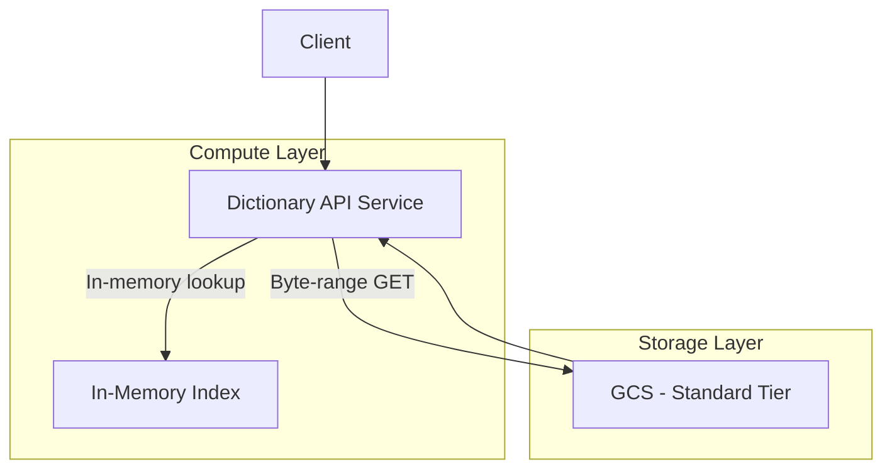
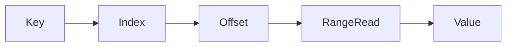
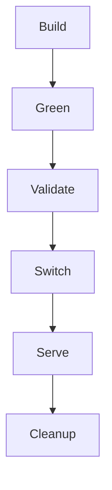
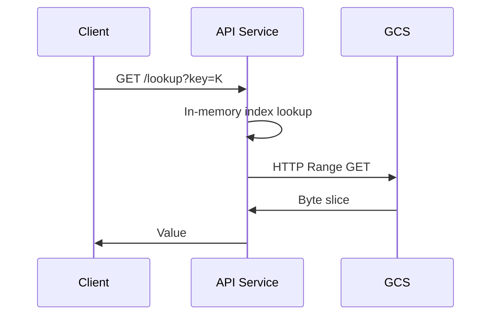
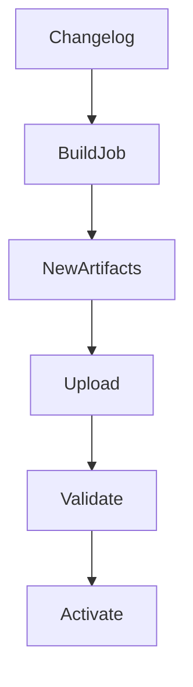

# Architecture Review Board (ARB)
## Read‑Optimized Dictionary Platform (Detailed Design)

---

## 1. Document Control

| Field | Value |
|---|---|
| Document Type | Architecture Review Board (ARB) |
| System Name | Read‑Optimized Dictionary Platform |
| Author | Saurabh Maurya |
| Role | IaC / Platform Engineer |
| Cloud Provider | Google Cloud Platform |
| Status | Proposed for Approval |
| Version | v1.1 |
| Last Updated | 2025-01-01 |

---

## 2. Executive Summary

This document proposes a **read‑optimized, cost‑efficient dictionary platform** designed to serve **millions of lookups per month** over a **large, mostly immutable dataset**. The system is optimized for:

- Extremely low infrastructure cost
- Predictable and bounded latency
- Simple operational and failure model
- Safe, zero‑downtime data updates

Instead of using traditional databases, the architecture leverages **object storage + in‑memory indexing + byte‑range reads**, a proven industry pattern used in search indexes, analytics engines, and static knowledge bases.

This approach intentionally trades **write flexibility** for **read efficiency and cost predictability**, which aligns perfectly with the problem domain.

---

## 3. Business & Technical Context

### 3.1 Problem Being Solved

We need a system that:

- Stores a large key‑value dataset (≈ 1M keys)
- Serves **read‑heavy traffic** (100K → 10M+ reads/month)
- Supports **random access** to values (offset + length)
- Receives **weekly changelog updates**
- Must operate under **strict budget constraints (≤ ₹2,000/month)**

### 3.2 Key Constraints

- Dataset is mostly immutable
- Writes are batch‑oriented, not real‑time
- Cost must scale linearly with usage
- Operations must remain simple (small team / solo maintainer)

---

## 4. Architectural Goals

| Goal | Description |
|---|---|
| Cost Efficiency | Avoid always‑on databases and idle compute |
| Read Performance | Low p50/p99 latency for random reads |
| Simplicity | Fewer moving parts, fewer failure modes |
| Safety | No partial updates, easy rollback |
| Scalability | Linear scale with dataset and traffic |

---

## 5. High‑Level Architecture



**Key Principle:**
> The storage layer is dumb and cheap; intelligence lives in the application.

---

## 6. Core Architectural Decisions (ADRs)

### ADR‑01: Use Object Storage Instead of a Database

**Decision**  
Use Google Cloud Storage (Standard) as the primary data store.

**Alternatives Considered**
- Cloud SQL (Postgres/MySQL)
- Firestore / Datastore
- Bigtable

**Why Alternatives Were Rejected**
- High baseline cost
- Inefficient for immutable bulk data
- Read amplification and index overhead

**Why This Decision Is Correct**
- Object storage is orders of magnitude cheaper
- Byte‑range reads allow precise access
- No operational burden of managing databases

---

### ADR‑02: Immutable Data Files

**Decision**  
Treat data files as immutable artifacts.

**Rationale**
- Eliminates partial write corruption
- Enables atomic version switching
- Simplifies concurrency and recovery

**Trade‑off**
- Requires full rebuild on update (acceptable due to weekly cadence)

---

### ADR‑03: Separate Index and Data Files



**Decision**  
Maintain a dedicated index file mapping key → (offset, length).

**Why This Is Good**
- Index fits entirely in memory (~50 MB)
- Enables O(1) lookup
- Avoids scanning large files

---

### ADR‑04: Store Keys as Plain Strings

**Decision**  
Store keys as UTF‑8 strings (not hashes).

**Why**
- Enables autocomplete and prefix search
- Easier debugging and observability
- No collision risk

**Trade‑off**
- Slightly larger index (acceptable)

---

### ADR‑05: Blue‑Green Data Deployment



**Why This Matters**
- Zero downtime
- Instant rollback
- Safe experimentation

---

### ADR‑06: GCS Standard Storage Tier

**Decision**  
Use GCS Standard instead of Nearline/Coldline.

**Why**
- Read‑heavy workload
- Predictable latency
- No read penalties

---

## 7. Data Layout

```
bucket/
 ├── data/
 │    ├── dict_YYYY‑MM‑DD.bin
 │    └── dict_active.bin
 ├── index/
 │    ├── index_YYYY‑MM‑DD.bin
 │    └── index_active.bin
 └── metadata/
      └── active_version.json
```

**Atomic switch** is achieved by updating `active_version.json`.

---

## 8. Index Design Details

Each index entry contains:

| Field | Size |
|---|---|
| Key (avg 30 chars) | ~30 bytes |
| Offset (uint64) | 8 bytes |
| Length (uint32) | 4 bytes |
| Delimiter / overhead | ~6 bytes |
| **Total per key** | **~48 bytes** |

**Total index size (1M keys): ~50 MB**

This comfortably fits in memory and allows extremely fast lookups.

---

## 9. Read Path (Critical Path)



**Latency Characteristics**
- Index lookup: microseconds
- Storage read: network‑bound (ms)
- Total p99 < 40 ms

---

## 10. Update & Changelog Flow



- Weekly scheduled rebuild
- Offline processing
- No impact on live traffic

---

## 11. Capacity Planning

### 11.1 Storage

| Component | Size |
|---|---|
| Data file | ~1.02 GB |
| Index file | ~50 MB |
| Metadata | < 1 MB |
| **Total per version** | **~1.07 GB** |
| Blue‑Green total | ~2.14 GB |

---

## 12. Cost Analysis

### Monthly Cost (10M reads)

| Component | Cost |
|---|---|
| Storage | ~$0.50 |
| Read Operations | ~$4.00 |
| Network Egress | ~$5‑7 |
| **Total** | **~$10‑12** |

This remains well within the stated budget.

---

## 13. Latency SLOs

| Metric | Target |
|---|---|
| p50 | < 15 ms |
| p95 | < 25 ms |
| p99 | < 40 ms |

---

## 14. Security Considerations

- IAM‑restricted bucket access
- Read‑only permissions for API
- No direct client access to storage
- No PII stored

---

## 15. Risks & Mitigations

| Risk | Mitigation |
|---|---|
| Corrupt build | Blue‑green rollback |
| Hot keys | In‑process caching |
| Dataset growth | Sharding strategy |

---

## 16. Final Recommendation

**APPROVED** ✅

This architecture is **cost‑optimal, scalable, operationally simple**, and well‑suited for the stated problem. It intentionally avoids unnecessary complexity while meeting all functional and non‑functional requirements.

---

## 17. Future Enhancements

- CDN / edge caching
- Prefix index for autocomplete
- Compression (ZSTD)
- Sharded index beyond 10M keys

---

*End of Document*

